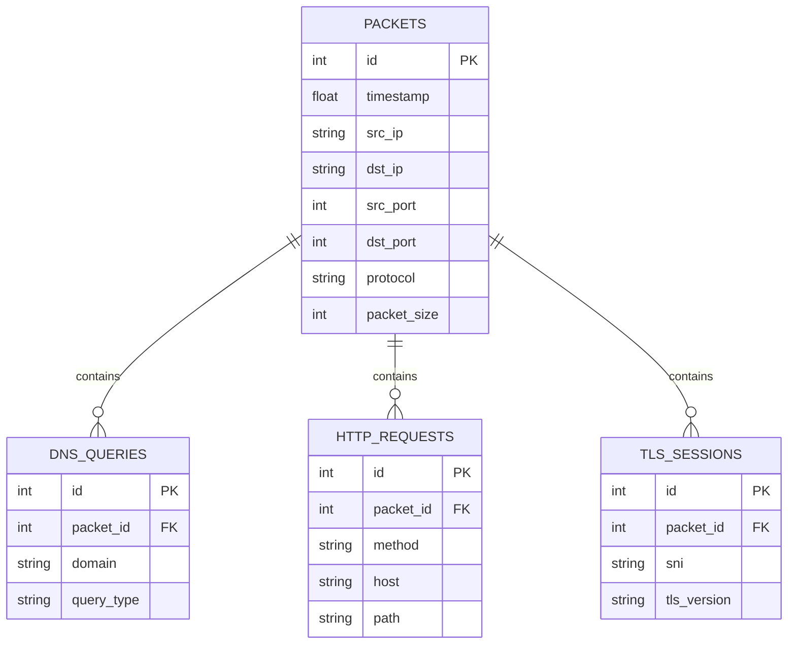

# PacketInsight: Network Traffic Intelligence Platform

PacketInsight is a network traffic analysis and intelligence platform. It analyzes packets from raw packet captures (PCAP/CAP), extracts metadata across multiple network layers, performs application-level protocol parsing (DNS, HTTP, TLS, etc.), generates summary statistics, and persists records into a relational database for threat intelligence and flow analysis.

---

## 🚀 Key Features

* **Offline PCAP Analyzer**: Loads and parses packet captures utilizing an optimized packet reader.
* **Multi-Layer Protocol Parser**: Extracts Ethernet, IP, TCP, and UDP packet metadata.
* **Application Protocol Detection**: Categorizes network traffic (including HTTP, HTTPS, DNS, SSH, SMTP, DHCP).
* **Deep Packet Content Extraction**:
  * **DNS Queries**: Domains, query types (A, AAAA, MX, CNAME, etc.).
  * **HTTP Requests**: Methods (GET/POST/etc.), Target Hosts, and URL Paths.
  * **TLS Sessions**: SNI (Server Name Indication) and TLS Versions.
* **Relational Database Storage**: Persists analyzed packet records and associated session data using SQLite and SQLAlchemy ORM in bulk batches.
* **Auto-Demo Mode**: If a requested `.pcap` file is missing, the tool automatically generates a sample PCAP file with realistic mock traffic (DNS, HTTP, TLS, SSH, DHCP) to run a demonstration.

---

## 🗄️ Database Schema (Phase 2)

PacketInsight saves analysis results to a local SQLite database (`packets.db` by default) with the following relational schema:



---

## 📁 Directory Structure

```text
D:/PacketInsight/
├── packet_analyzer/          # Core python package
│   ├── __init__.py           # Suppresses Scapy runtime logging warnings
│   ├── analyzer.py           # Main CLI controller and entry point
│   ├── database.py           # SQLAlchemy database configuration and models
│   ├── parser.py             # Packet metadata and sub-protocol parsers
│   ├── protocols.py          # Transport and Application layer detectors
│   ├── reader.py             # Interface to read capture files
│   ├── report.py             # Structured text report builder
│   ├── repository.py         # DB Repository implementing bulk saves
│   ├── statistics.py         # StatsEngine to calculate counters
│   └── utils.py              # Common string/domain formatting utilities
├── pcaps/                    # Directory for PCAP/CAP capture files
├── reports/                  # Default output directory for text reports
├── requirements.txt          # Python dependencies
└── README.md                 # This file
```

---

## ⚙️ Setup & Installation

1. **Activate your environment** and run:
   ```bash
   pip install -r requirements.txt
   ```
   *Note: If scapy prints a warning about missing `libpcap` on Windows, it can be safely ignored. PacketInsight suppresses this warning automatically for offline parsing.*

---

## 💻 Usage & CLI Reference

### 1. Analyze and Persist (Default)
Analyze a PCAP file, print a terminal summary, save a text report to `reports/report.txt`, and save all packets to a local SQLite database (`packets.db`):
```bash
python -m packet_analyzer.analyzer .\pcaps\test.pcap
```

### 2. Save to a Custom Database
Store data in a specific SQLite database path:
```bash
python -m packet_analyzer.analyzer .\pcaps\test.pcap --db-path data/custom_packets.db
```

### 3. Run Analysis Without Database Persistence
Run in-memory analysis and generate a text report only:
```bash
python -m packet_analyzer.analyzer .\pcaps\test.pcap --db-path none
```

### 4. Save Text Report to Custom Location
Change where the text summary report is saved:
```bash
python -m packet_analyzer.analyzer .\pcaps\test.pcap --output reports/custom_run.txt
```

---

## 📄 Sample Text Report

Running the analyzer prints and saves a report formatted as follows:

```text
================================
PACKET ANALYSIS REPORT
================================

Analyzed File: D:\PacketInsight\pcaps\test.pcap
Total Packets: 15
Processed Packets: 15
Skipped Packets: 0

Protocol Statistics:
DHCP: 1
DNS: 5
HTTP: 3
SMTP: 1
SSH: 1
TLS: 3
UDP: 1

Top Source IPs:
192.168.1.10: 8
192.168.1.15: 1
0.0.0.0: 1
192.168.1.11: 1
192.168.1.12: 1

Top Destination IPs:
8.8.8.8: 5
140.82.121.4: 3
93.184.216.34: 3
192.168.1.200: 1
74.125.142.27: 1

Top DNS Queries:
google.com: 1
github.com: 1
python.org: 1
wikipedia.org: 1
openai.com: 1

Sample HTTP Requests:
GET example.com/index.html
POST api.example.com/v1/data
GET python.org/downloads/

TLS Hosts:
github.com: 1
google.com: 1
microsoft.com: 1

================================
```
