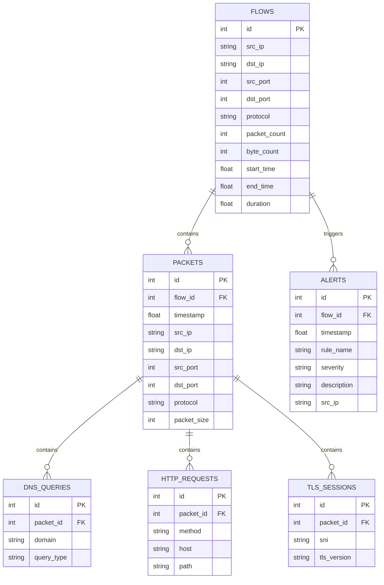
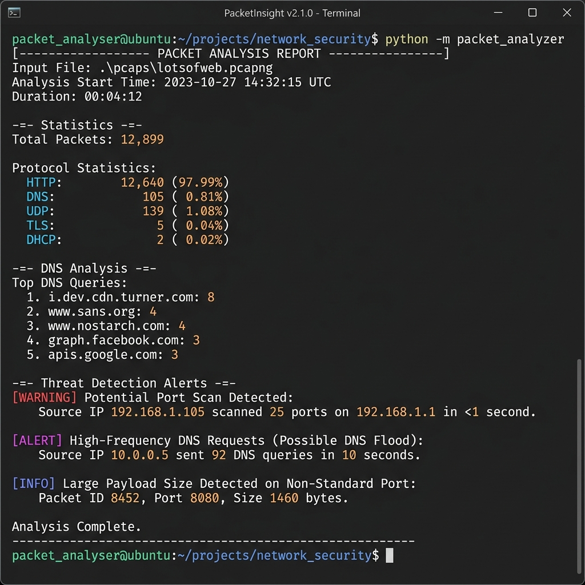

# PacketInsight: Network Traffic Intelligence Platform

PacketInsight is a network traffic analysis and intelligence platform. It analyzes packets from raw packet captures (PCAP/CAP), extracts metadata across multiple network layers, performs application-level protocol parsing (DNS, HTTP, TLS, etc.), generates summary statistics, and persists records into a relational database for threat intelligence and flow analysis.

---

## 🚀 Key Features

* **Offline PCAP Analyzer**: Loads and parses packet captures utilizing an optimized packet reader.
* **Multi-Layer Protocol Parser**: Extracts Ethernet, IP, TCP, and UDP packet metadata.
* **Application Protocol Detection**: Categorizes network traffic (including HTTP, HTTPS, DNS, SSH, SMTP, DHCP).
* **Deep Packet Content Extraction**:
  * **DNS Queries**: Domains, query types (A, AAAA, MX, CNAME, etc.).
  * **HTTP Requests**: Methods (GET/POST/etc.), Target Hosts, and URL Paths.
  * **TLS Sessions**: SNI (Server Name Indication) and TLS Versions.
* **Bidirectional Flow Analysis**: Groups packets into network flows using canonical 5-tuples and calculates flow statistics (packet counters, byte count, start/end timestamps, and duration).
* **Rule-Based Threat Detection**: Scans flows and packets against security rules to identify port scanning, DNS floods, and high-volume data transmissions.
* **Relational Database Storage**: Persists analyzed flows, packets, sub-protocols, and security alerts using SQLite and SQLAlchemy ORM.
* **Flexible Report Formats**: Supports text reports, JSON exports, and CSV summaries (flows and packet log files).
* **Fallback Demo Generator**: If a requested `.pcap` file is missing, the tool automatically generates a sample PCAP file with mock traffic as a fallback helper for instant demonstration.

---

## 🗄️ Database Schema

PacketInsight saves analysis results to a local SQLite database (`packets.db` by default) with the following relational schema:



---

## 📁 Directory Structure

```text
D:/PacketInsight/
├── packet_analyzer/          # Core python package
│   ├── __init__.py           # Suppresses Scapy runtime logging warnings
│   ├── analyzer.py           # Main CLI controller and entry point
│   ├── database.py           # SQLAlchemy database configuration and models
│   ├── detector.py           # Rule-based threat detection rules
│   ├── parser.py             # Packet metadata and sub-protocol parsers
│   ├── protocols.py          # Transport and Application layer detectors
│   ├── reader.py             # Interface to read capture files
│   ├── report.py             # Structured text, JSON, and CSV report builders
│   ├── repository.py         # DB Repository implementing flow and packet saving
│   ├── statistics.py         # StatsEngine to calculate counters and track flows
│   ├── test_features.py      # Integration test script for flows/alerts
│   └── utils.py              # Common string/domain formatting utilities
├── pcaps/                    # Directory for PCAP/CAP capture files
├── reports/                  # Default output directory for reports
├── requirements.txt          # Python dependencies
└── README.md                 # This file
```

---

## ⚙️ Setup & Installation

1. **Activate your environment** and run:
   ```bash
   pip install -r requirements.txt
   ```
   *Note: If scapy prints a warning about missing `libpcap` on Windows, it can be safely ignored. PacketInsight suppresses this warning automatically for offline parsing.*

---

## 💻 Usage & CLI Reference

### 1. Analyze and Persist (Default)
Analyze a PCAP file, print a terminal summary, save a text report to `reports/report.txt`, and save all packets to a local SQLite database (`packets.db`):
```bash
python -m packet_analyzer.analyzer .\pcaps\test.pcap
```

### 2. Save to a Custom Database
Store data in a specific SQLite database path:
```bash
python -m packet_analyzer.analyzer .\pcaps\test.pcap --db-path data/custom_packets.db
```

### 3. Run Analysis Without Database Persistence
Run in-memory analysis and generate a text report only:
```bash
python -m packet_analyzer.analyzer .\pcaps\test.pcap --db-path none
```

### 4. Save Text Report to Custom Location
Change where the text summary report is saved:
```bash
python -m packet_analyzer.analyzer .\pcaps\test.pcap --output reports/custom_run.txt
```

### 5. Export JSON and CSV Reports
Save structured reports in JSON and CSV format:
```bash
python -m packet_analyzer.analyzer .\pcaps\test.pcap --json reports/report.json --csv reports/report_prefix
```
*Note: The `--csv` flag generates both a flow summary CSV (`[prefix]_flows.csv`) and a packet log CSV (`[prefix]_packets.csv`).*

---

## 📄 Sample Text Report

Running the analyzer prints and saves a report formatted as follows:

```text
================================
PACKET ANALYSIS REPORT
================================

Analyzed File: D:\PacketInsight\pcaps\test.pcap
Total Packets: 15
Processed Packets: 15
Skipped Packets: 0

Protocol Statistics:
DHCP: 1
DNS: 5
HTTP: 3
SMTP: 1
SSH: 1
TLS: 3
UDP: 1

Top Source IPs:
192.168.1.10: 8
192.168.1.15: 1
0.0.0.0: 1
192.168.1.11: 1
192.168.1.12: 1

Top Destination IPs:
8.8.8.8: 5
140.82.121.4: 3
93.184.216.34: 3
192.168.1.200: 1
74.125.142.27: 1

Top DNS Queries:
google.com: 1
github.com: 1
python.org: 1
wikipedia.org: 1
openai.com: 1

Sample HTTP Requests:
GET example.com/index.html
POST api.example.com/v1/data
GET python.org/downloads/

TLS Hosts:
github.com: 1
google.com: 1
microsoft.com: 1

================================
```

---

## 🛡️ Tested Against Real-World Traffic

PacketInsight is validated against real network packet captures. Below is the verification report from parsing a real-world multi-client web session capture (`lotsofweb.pcapng`) containing over 12,800 packets:

### Real Traffic Analysis Result Table

```text
==================================
PACKET ANALYSIS REPORT
==================================

Analyzed File: pcaps/lotsofweb.pcapng
Total Packets: 12899
Processed Packets: 12899
Skipped Packets: 0

Protocol Statistics:
DHCP: 2
DNS: 105
HTTP: 12640
HTTPS: 5
TLS: 5
UDP: 139

Top Source IPs:
74.125.103.163: 2882
172.16.16.128: 2790
172.16.16.136: 1137
172.16.16.197: 1107
66.35.45.201: 596

Top Destination IPs:
172.16.16.128: 5534
172.16.16.136: 1212
172.16.16.197: 1050
74.125.103.163: 1045
66.35.45.201: 510

Top DNS Queries:
i.dev.cdn.turner.com: 8
i.dev.cdn.turner.com.ewaphoenix.com: 8
pagead2.googlesyndication.com: 4
www.nostarch.com: 4
www.sans.org: 4

Sample HTTP Requests:
GET online.wsj.com/public/page/0_0_WH_0001_public_breakingnewscontent.html
GET www.cnn.com/
GET i.cdn.turner.com/cnn/.element/css/3.0/common.css
GET i.cdn.turner.com/cnn/.element/js/3.0/protoaculous.1.8.2.min.js
GET i.cdn.turner.com/cnn/.element/css/3.0/main.css

TLS Hosts:
TLS traffic on port 443: 5

Flow Analysis Summary (Top 5):
  172.16.16.128:3000 <-> 74.125.103.163:80 (HTTP) | Packets: 3927 | Bytes: 4232435 | Duration: 54.31s
  172.16.16.128:2986 <-> 74.125.103.147:80 (HTTP) | Packets: 608 | Bytes: 633494 | Duration: 7.54s
  172.16.16.128:2938 <-> 209.85.225.165:80 (HTTP) | Packets: 274 | Bytes: 288878 | Duration: 48.37s
  172.16.16.128:2985 <-> 74.125.166.28:80 (HTTP) | Packets: 255 | Bytes: 252665 | Duration: 31.22s
  172.16.16.136:60710 <-> 66.35.45.201:80 (HTTP) | Packets: 219 | Bytes: 205628 | Duration: 44.86s

Security Alerts:
  [HIGH] Port Scan - Host 172.16.16.128 scanned 7 different ports: [53, 80, 137, 161, 427, 1900, 5355]. (Time: 1258920198.46)
  [HIGH] Port Scan - Host 172.16.16.136 scanned 3 different ports: [53, 80, 443]. (Time: 1258920198.46)
  [HIGH] DNS Flood - Host 172.16.16.128 sent 16 DNS queries, exceeding threshold of 3. (Time: 1258920198.46)
  [HIGH] DNS Flood - Host 172.16.16.197 sent 63 DNS queries, exceeding threshold of 3. (Time: 1258920198.46)
  [HIGH] DNS Flood - Host 172.16.16.136 sent 26 DNS queries, exceeding threshold of 3. (Time: 1258920198.46)
  ... [truncated for readability]

==================================
```

### Terminal Run Screenshot

Below is a terminal screenshot showing the PacketInsight analyzer successfully processing the real-world PCAP file and outputting structured analysis and threat detection alerts:


